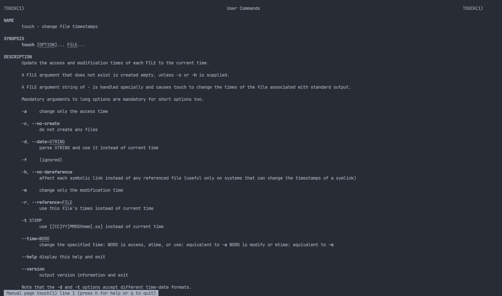
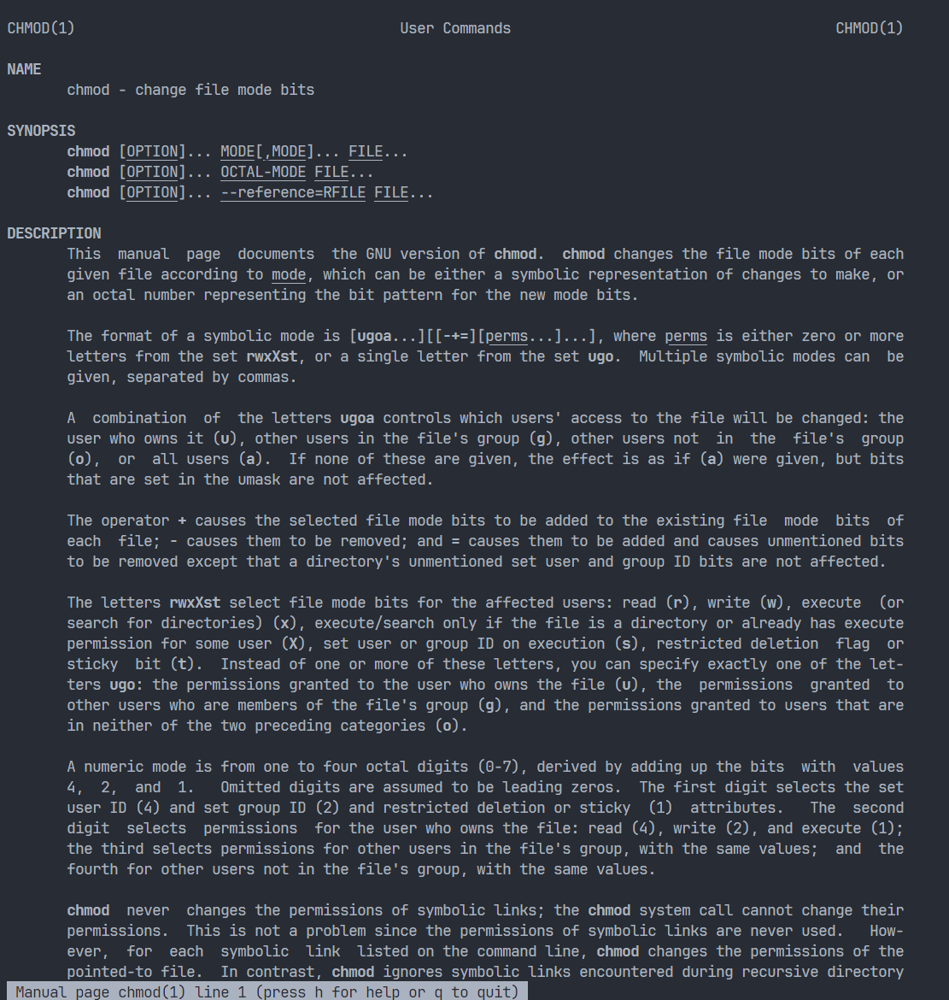

# Ch01——课程概览与 shell

## 1

本课程需要使用类Unix shell，例如 Bash 或 ZSH。如果您在 Linux 或者 MacOS 上面完成本课程的练习，则不需要做任何特殊的操作。如果您使用的是 Windows，则您不应该使用 cmd 或是 Powershell；您可以使用[Windows Subsystem for Linux](https://docs.microsoft.com/en-us/windows/wsl/)或者是 Linux 虚拟机。使用`echo $SHELL`命令可以查看您的 shell 是否满足要求。如果打印结果为`/bin/bash`或`/usr/bin/zsh`则是可以的。

> 

## 2

在 `/tmp` 下新建一个名为 `missing` 的文件夹。

> 

## 3

用 `man` 查看程序 `touch` 的使用手册。

> 

## 4

用 `touch` 在 `missing` 文件夹中新建一个叫 `semester` 的文件。

> 

## 5

将以下内容一行一行地写入 `semester` 文件：

```bash
#!/bin/sh
curl --head --silent https://missing.csail.mit.edu
```

第一行可能有点棘手， `#` 在 Bash 中表示注释，而 `!` 即使被双引号（`"`）包裹也具有特殊的含义。 单引号（`'`）则不一样，此处利用这一点解决输入问题。更多信息请参考 [Bash quoting 手册](https://www.gnu.org/software/bash/manual/html_node/Quoting.html)

> 

## 6

尝试执行这个文件。例如，将该脚本的路径（`./semester`）输入到您的shell中并回车。如果程序无法执行，请使用 `ls` 命令来获取信息并理解其不能执行的原因。

> 

## 7

查看 `chmod` 的手册(例如，使用 `man chmod` 命令)

> 

## 8

使用 `chmod` 命令改变权限，使 `./semester` 能够成功执行，不要使用 `sh semester` 来执行该程序。您的 shell 是如何知晓这个文件需要使用 `sh` 来解析呢？更多信息请参考：[shebang](https://en.wikipedia.org/wiki/Shebang_(Unix))

> 
>
> **回答** ：shebang 指的是脚本开头的 `#!` ，后面跟着解释器的绝对路径。
>
> 在 `semester` 文件中，`#!/bin/sh` 指明该文件应该由目录 `/bin` 下的 `sh` 解释器来解析。

## 9

使用 `|` 和 `>` ，将 `semester` 文件输出的最后更改日期信息，写入主目录下的 `last-modified.txt` 的文件中。

> 

## 10

写一段命令来从 `/sys` 中获取笔记本的电量信息，或者台式机 CPU 的温度。注意：macOS 并没有 `sysfs` ，所以 Mac 用户可以跳过这一题。

> 
