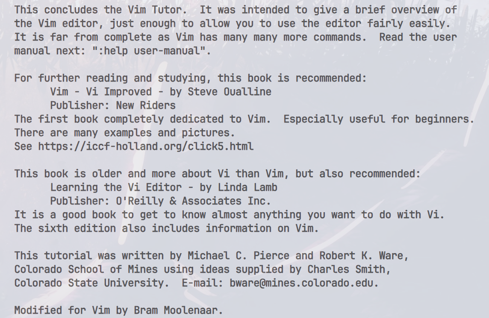
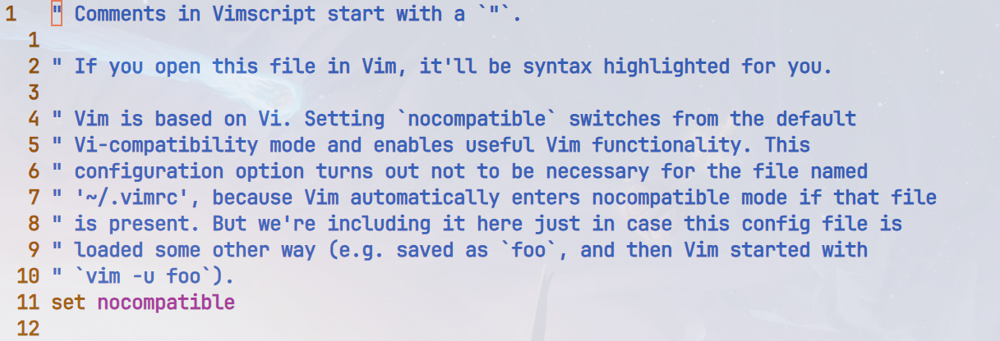

# Ch03——编辑器(Vim)

## 1

完成`vimtutor`。备注：它在一个 80x24(80 列，24 行)终端窗口看起来效果最好。

>

## 2

下载我们提供的`vimrc`，然后把它保存到`~/.vimrc`。通读这个注释详细的文件(用 Vim! )，然后观察 Vim 在这个新的设置下看起来和使用起来有哪些细微的区别。

>

## 3

安装和配置一个插件：`ctrlp.vim`。
用`mkdir -p ~/.vim/pack/vendor/start`创建插件文件夹
下载这个插件：`cd ~/.vim/pack/vendor/start; git clone https://github.com/ctrlpvim/ctrlp.vim`
阅读这个插件的文档。 尝试用 CtrlP 来在一个工程文件夹里定位一个文件，打开 Vim, 然后用 Vim 命令控制行开始 :CtrlP.
自定义 CtrlP： 添加 configuration 到你的`~/.vimrc`来用按 `Ctrl-P` 打开 CtrlP

>

## 4

练习使用 Vim, 在你自己的机器上重做演示。

## 5

下个月用 Vim 完成 所有的文件编辑。每当不够高效的时候，或者你感觉 “一定有一个更好的方式”时，尝试求助搜索引擎，很有可能有一个更好的方式。如果你遇到难题，可以来我们的答疑时间或者给我们发邮件。

## 6

在其他工具中设置 Vim 快捷键 （见上面的操作指南）。

## 7

进一步自定义你的`~/.vimrc`和安装更多插件。

## 8

（高阶）用 Vim 宏将 XML 转换到 JSON (例子文件)。 尝试着先完全自己做，但是在你卡住的时候可以查看上面 宏 章节。
